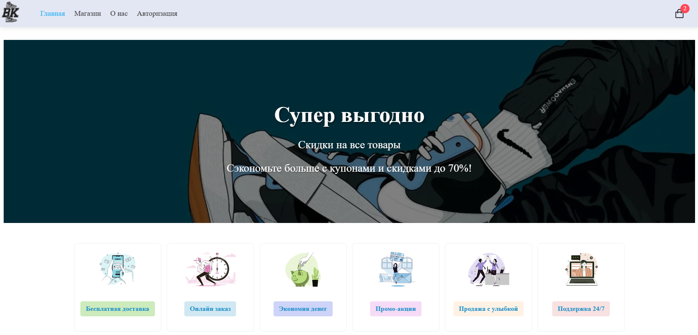

# Sneakers Shop - Интернет-магазин кроссовок

 <!-- Добавьте скриншот в папку public -->

## 🛠 Технологии
- **Frontend**: Vue 3, Pinia, Vue Router
- **Стили**: SCSS
- **Иконки**: Boxicons
- **Сборка**: Vite

## 🌟 Особенности
- Каталог товаров с пагинацией
- Корзина с изменяемым количеством товаров
- Адаптивный дизайн
- Анимации интерфейса
- Форматирование цен для RU-локали

## 🚀 Установка

1. Клонируйте репозиторий:
```bash
git clone https://github.com/ваш-username/sneakers-shop.git
cd sneakers-shop
```

2. Установите зависимости:
```bash
npm install
```

3. Запустите сервер разработки:
```bash
npm run dev
```

4. Для продакшн-сборки:
```bash
npm run build
```

## 📂 Структура проекта
```
src/
├── assets/          # Статические ресурсы
├── components/      # Vue компоненты
├── stores/          # Pinia хранилища
├── router/          # Маршрутизация
├── views/           # Страницы
├── services/        # Бизнес-логика
├── utils/           # Вспомогательные функции
└── styles/          # Глобальные стили
```

## 🔥 Скрипты
- `dev`: Запуск dev-сервера
- `build`: Сборка для production
- `preview`: Локальный просмотр сборки
- `lint`: Проверка кода

## 📜 Лицензия

---

<div align="center">
  <sub> </sub>
</div>
```